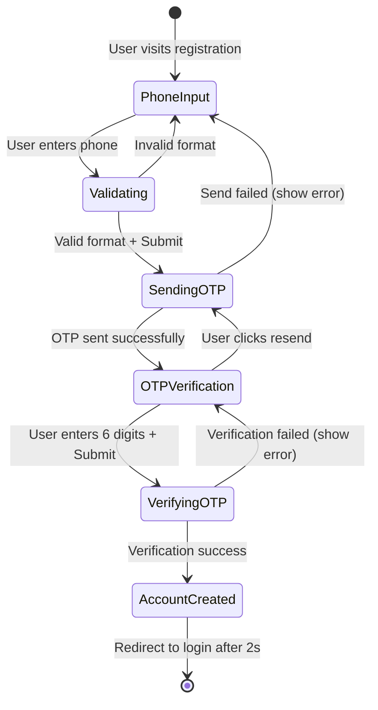

# Design Document: Phone-Based OTP Registration

## Overview

This design simplifies the user registration process by implementing a phone-only authentication flow using OTP verification. The solution removes the multi-field registration form (name, email, password) and replaces it with a streamlined two-step process:

1. **Phone Number Entry**: User enters their Saudi mobile number (05XXXXXXXX format)
2. **OTP Verification**: System automatically sends OTP and user verifies to complete registration

**Key Innovation**: The registration process combines both account creation AND automatic login in a single flow. After successful OTP verification, the user is immediately logged in and redirected to the Home page without needing a separate login step.

The design leverages the existing `/user/send-login-code` endpoint for both registration and login flows, creating a unified authentication experience. Upon successful OTP verification, the system automatically creates a user account, establishes an authenticated session, and logs the user in.

**Key Design Principles:**
- Minimize user friction by reducing required input fields
- Combine registration and login into a single seamless flow
- Reuse existing API endpoints to avoid backend changes
- Maintain consistency with the current login UI/UX
- Provide clear, real-time validation feedback
- Handle errors gracefully with Arabic error messages

## Architecture

### Component Structure

```
Register.jsx (Simplified)
├── Phone Input Step
│   ├── Phone Number Input Field
│   ├── Real-time Validation
│   └── Submit Button
│
└── OTP Verification Step
    ├── 6-Digit OTP Input Boxes
    ├── Auto-focus Navigation
    ├── Verify Button
    ├── Resend Button with Timer
    └── Success/Error Messages
```

### State Management

The component will use React's `useState` hook to manage:

1. **Current Step**: Track whether user is on phone input or OTP verification
2. **Phone Number**: Store and validate the entered phone number
3. **OTP Digits**: Array of 6 digits for OTP input
4. **Loading States**: Track API call progress
5. **Validation States**: Real-time validation feedback
6. **Timer State**: Countdown for OTP resend functionality
7. **Error/Success Messages**: User feedback

### Flow Diagram



## Components and Interfaces

### 1. Register Component (Simplified)

**File**: `src/components/Register/Register.jsx`

**State Structure**:
```javascript
{
  currentStep: 'phone' | 'otp' | 'success',
  phoneNumber: string,
  phoneValidation: {
    isValid: boolean,
    message: string
  },
  otpDigits: [string, string, string, string, string, string],
  isLoading: boolean,
  error: string,
  success: string,
  resendTimer: number
}
```

**Key Functions**:

- `handlePhoneInput(value)`: Validates and updates phone number
  - Strips non-numeric characters
  - Validates Saudi format (05XXXXXXXX)
  - Updates validation state in real-time

- `handleSubmitPhone()`: Submits phone number and sends OTP
  - Validates phone format
  - Calls `/user/send-login-code` endpoint
  - Transitions to OTP step on success
  - Displays error on failure

- `handleOtpChange(index, value)`: Manages OTP digit input
  - Updates specific digit in array
  - Auto-focuses next input on entry
  - Clears error messages

- `handleOtpKeyDown(index, event)`: Handles backspace navigation
  - Focuses previous input on backspace when current is empty

- `handleVerifyOtp()`: Verifies OTP and creates account
  - Validates all 6 digits are entered
  - Calls verification endpoint
  - Creates account on success
  - Transitions to success step

- `handleResendOtp()`: Resends OTP code
  - Calls `/user/send-login-code` again
  - Starts 60-second countdown timer
  - Disables resend button during countdown

### 2. Phone Input UI

**Layout**:
```
┌─────────────────────────────────┐
│  [Logo]              [← Back]   │
├─────────────────────────────────┤
│                                 │
│     إنشاء حساب جديد             │
│                                 │
│  ┌───────────────────────────┐  │
│  │ رقم الهاتف (05xxxxxxxx)  │  │
│  └───────────────────────────┘  │
│  ✓ رقم الهاتف صحيح              │
│                                 │
│  ┌───────────────────────────┐  │
│  │      إرسال رمز التحقق     │  │
│  └───────────────────────────┘  │
│                                 │
│  هل لديك حساب؟ تسجيل الدخول     │
│                                 │
└─────────────────────────────────┘
```

**Validation Rules**:
- Only numeric input allowed (0-9)
- Exactly 10 digits required
- Must start with "05"
- Real-time validation feedback with icons (✓ or ✗)

### 3. OTP Verification UI

**Layout**:
```
┌─────────────────────────────────┐
│  [Logo]              [← Back]   │
├─────────────────────────────────┤
│                                 │
│     التحقق من رقم الهاتف        │
│                                 │
│  تم إرسال رمز التحقق إلى        │
│        0501234567               │
│                                 │
│  ┌─┐ ┌─┐ ┌─┐ ┌─┐ ┌─┐ ┌─┐      │
│  │ │ │ │ │ │ │ │ │ │ │ │      │
│  └─┘ └─┘ └─┘ └─┘ └─┘ └─┘      │
│                                 │
│  ┌───────────────────────────┐  │
│  │      تحقق من الرمز        │  │
│  └───────────────────────────┘  │
│                                 │
│  إعادة الإرسال خلال 45 ثانية    │
│                                 │
└─────────────────────────────────┘
```

**OTP Input Behavior**:
- 6 individual input boxes for digits
- Auto-focus next box on digit entry
- Auto-focus previous box on backspace
- Numeric keyboard on mobile devices
- Visual focus indicators

### 4. Success Screen UI

**Layout**:
```
┌─────────────────────────────────┐
│  [Logo]              [← Back]   │
├─────────────────────────────────┤
│                                 │
│     تم التحقق بنجاح!            │
│                                 │
│         ┌───────┐               │
│         │   ✓   │               │
│         └───────┘               │
│                                 │
│  تم التحقق من رقم هاتفك بنجاح!  │
│                                 │
│  سيتم توجيهك إلى الصفحة الرئيسية │
│  خلال ثوانٍ...                  │
│                                 │
└─────────────────────────────────┘
```

### 5. API Integration

**Endpoint**: `{{baseUrl}}/user/send-login-code`

**Request**:
```javascript
{
  method: 'POST',
  headers: {
    'Content-Type': 'application/json'
  },
  body: JSON.stringify({
    phone_number: "0578777418"
  })
}
```

**Response (Success)**:
```javascript
{
  status: "success",
  data: [],
  message: "OTP sent successfully"
}
```

**Response (Error)**:
```javascript
{
  status: "error",
  message: "Error description in Arabic"
}
```

**Verification Endpoint**: (Assumed based on existing code)
- Uses existing `verifyPhoneOTP(phoneNumber, otpCode)` function
- Returns success/error status
- On success, creates user account automatically

### 6. Authentication Context Integration

The `AuthContext` will be updated to handle the new registration flow where registration = registration + login:

**Current Login Flow**:
```javascript
login(userData, token) {
  setUser(userData);
  localStorage.setItem('authToken', token);
  localStorage.setItem('userData', JSON.stringify(userData));
}
```

**New Registration Flow (Registration + Login Combined)**:
After successful OTP verification, the system will:
1. Receive authentication token from verification endpoint
2. Create minimal user data object with phone number
3. Call `login()` to establish authenticated session (this is the login part)
4. Redirect to Home page (user is now fully authenticated and logged in)

**Key Difference**: Unlike the old flow where registration redirected to login, the new flow completes BOTH registration AND login in one operation. The user is fully authenticated when they arrive at the Home page.

## Data Models

### Phone Number Validation Model

```javascript
{
  value: string,           // Raw phone number input
  isValid: boolean,        // Validation result
  message: string,         // Feedback message in Arabic
  format: /^05\d{8}$/     // Saudi phone format regex
}
```

### OTP State Model

```javascript
{
  phoneNumber: string,     // Verified phone number
  digits: string[6],       // Array of 6 OTP digits
  isComplete: boolean,     // All 6 digits entered
  isLoading: boolean,      // API call in progress
  error: string,           // Error message
  success: string,         // Success message
  resendTimer: number,     // Countdown in seconds (0-60)
  canResend: boolean       // Timer expired, can resend
}
```

### Registration Step Model

```javascript
type RegistrationStep = 'phone' | 'otp' | 'success';

{
  currentStep: RegistrationStep,
  canProceed: boolean,     // Current step validation passed
  isLoading: boolean       // Any API call in progress
}
```

### User Account Model (Minimal)

After successful registration, the minimal user account will contain:

```javascript
{
  phone_number: string,    // Verified phone number
  id: string,              // User ID from backend
  // Additional fields may be added by backend
}
```


## Correctness Properties

*A property is a characteristic or behavior that should hold true across all valid executions of a system—essentially, a formal statement about what the system should do. Properties serve as the bridge between human-readable specifications and machine-verifiable correctness guarantees.*

### Property 1: Phone Number Validation

*For any* string input to the phone number field, the validation function should return `isValid: true` only when the input matches the Saudi phone format (exactly 10 digits starting with "05"), and should return an appropriate Arabic error message for all invalid formats.

**Validates: Requirements 1.2, 1.4**

### Property 2: Non-Numeric Character Filtering

*For any* string containing non-numeric characters entered into the phone number field, the input handler should strip all non-numeric characters and only store digits in the state.

**Validates: Requirements 1.3**

### Property 3: Real-Time Validation Updates

*For any* change to the phone number input value, the validation state should update immediately to reflect the current validity and provide feedback without requiring form submission.

**Validates: Requirements 1.5**

### Property 4: OTP Send API Integration

*For any* valid Saudi phone number submitted, the system should call the `/user/send-login-code` endpoint with a POST request containing `{"phone_number": "<phone>"}` in the request body.

**Validates: Requirements 2.1, 2.4**

### Property 5: OTP Digit Auto-Focus Navigation

*For any* OTP input box (index 0-4), when a digit is entered, the focus should automatically move to the next input box (index + 1).

**Validates: Requirements 3.2**

### Property 6: OTP Backspace Navigation

*For any* OTP input box (index 1-5), when backspace is pressed and the current box is empty, the focus should move to the previous input box (index - 1).

**Validates: Requirements 3.3**

### Property 7: Verification Button State

*For any* OTP input state, the verification button should be enabled if and only if all 6 digit positions contain a value, and disabled otherwise.

**Validates: Requirements 3.4**

### Property 8: OTP Verification API Call

*For any* complete 6-digit OTP code submitted, the system should call the verification endpoint with the phone number and OTP code as parameters.

**Validates: Requirements 3.5**

### Property 9: Resend OTP API Call

*For any* resend button click when the timer is at 0, the system should call the `/user/send-login-code` endpoint again with the same phone number.

**Validates: Requirements 4.2**

### Property 10: Resend Timer Button Disable

*For any* resend timer value greater than 0, the resend button should be disabled, and should only be enabled when the timer reaches exactly 0.

**Validates: Requirements 4.4**

### Property 11: Account Creation with Phone Number

*For any* successful OTP verification, the system should create or authenticate a user account that includes the verified phone number in the user data.

**Validates: Requirements 5.1**

### Property 12: Authentication Persistence

*For any* successful account creation, the system should persist both the authentication token and user data to localStorage, ensuring they can be retrieved on page reload.

**Validates: Requirements 5.5**

### Property 13: API Error Message Display

*For any* API error response containing a message field, the system should display that exact error message to the user in the error state.

**Validates: Requirements 6.2**

### Property 14: Loading State During API Calls

*For any* API call (send OTP, verify OTP, resend OTP), the system should set the loading state to true when the call starts and false when it completes (success or error).

**Validates: Requirements 7.5**

## Error Handling

### Validation Errors

**Phone Number Validation**:
- **Empty Input**: No error shown until user attempts to submit
- **Invalid Format**: Display "يرجى إدخال رقم هاتف سعودي صحيح (05xxxxxxxx)" in real-time
- **Non-Numeric Characters**: Automatically strip characters, no error needed
- **Incomplete Number**: Show validation error if less than 10 digits

**OTP Validation**:
- **Incomplete OTP**: Display "يرجى إدخال رمز التحقق المكون من 6 أرقام" on submit
- **Invalid OTP**: Display "رمز التحقق غير صحيح" from verification endpoint
- **Expired OTP**: Display error message from API response

### API Errors

**Network Errors**:
- **Connection Failed**: Display "حدث خطأ في الاتصال بالخادم. يرجى المحاولة مرة أخرى"
- **Timeout**: Display same network error message
- **No Response**: Display same network error message

**Server Errors**:
- **400 Bad Request**: Display error message from API response
- **500 Internal Server Error**: Display "حدث خطأ في الخادم. يرجى المحاولة لاحقاً"
- **Other Status Codes**: Display generic error message from API or fallback

**OTP Send Errors**:
- **Rate Limiting**: Display error message from API (e.g., "تم إرسال عدد كبير من الرسائل. يرجى الانتظار")
- **Invalid Phone**: Display error message from API
- **Service Unavailable**: Display network error message

**OTP Verification Errors**:
- **Wrong Code**: Display "رمز التحقق غير صحيح"
- **Expired Code**: Display error message from API
- **Too Many Attempts**: Display error message from API

### Error Recovery

**Retry Mechanisms**:
- **Phone Submission**: User can edit phone number and resubmit
- **OTP Verification**: User can re-enter OTP digits and retry
- **OTP Resend**: User can request new OTP after timer expires
- **Network Errors**: User can retry the same action after error

**State Cleanup**:
- Clear error messages when user starts typing
- Reset loading states after API calls complete
- Clear OTP digits on verification failure (optional, for security)
- Maintain phone number across retries

**User Guidance**:
- Show clear error messages in Arabic
- Provide actionable next steps (e.g., "يرجى المحاولة مرة أخرى")
- Display phone number in OTP screen for user reference
- Show resend timer to indicate when retry is available

## Testing Strategy

### Dual Testing Approach

This feature requires both **unit tests** and **property-based tests** to ensure comprehensive coverage:

- **Unit Tests**: Verify specific examples, edge cases, and error conditions
- **Property Tests**: Verify universal properties across all inputs

Both testing approaches are complementary and necessary. Unit tests catch concrete bugs in specific scenarios, while property tests verify general correctness across a wide range of inputs.

### Unit Testing

**Focus Areas**:
- Specific UI examples (phone input screen renders correctly)
- Edge cases (empty OTP submission, timer at boundary values)
- Error conditions (network failures, API errors)
- Integration points (AuthContext integration, localStorage)
- Navigation flows (step transitions, redirects)

**Example Unit Tests**:
1. Phone input screen displays single phone field (no name/email/password)
2. OTP screen displays exactly 6 input boxes
3. Success screen shows checkmark icon and success message
4. Submitting empty OTP shows error "يرجى إدخال رمز التحقق المكون من 6 أرقام"
5. Network error shows "حدث خطأ في الاتصال بالخادم"
6. Successful verification redirects to login after 2 seconds
7. Logo and back button are present in header
8. Login link is present on registration page
9. Timer starts at 60 seconds after resend
10. Resend button is disabled when timer > 0

### Property-Based Testing

**Testing Library**: Use **fast-check** for JavaScript/React property-based testing

**Configuration**:
- Minimum 100 iterations per property test
- Each test must reference its design document property
- Tag format: `// Feature: phone-otp-registration, Property N: <property text>`

**Property Test Implementation**:

Each correctness property listed above must be implemented as a single property-based test:

1. **Property 1**: Generate random strings, test validation returns correct result
2. **Property 2**: Generate strings with mixed characters, verify only digits remain
3. **Property 3**: Generate random phone inputs, verify validation updates immediately
4. **Property 4**: Generate valid phone numbers, verify API called with correct format
5. **Property 5**: Test digit entry in boxes 0-4, verify focus moves to next
6. **Property 6**: Test backspace in boxes 1-5, verify focus moves to previous
7. **Property 7**: Generate OTP states with varying completeness, verify button state
8. **Property 8**: Generate complete OTP codes, verify verification API called
9. **Property 9**: Test resend clicks when timer=0, verify API called
10. **Property 10**: Generate timer values, verify button disabled when timer>0
11. **Property 11**: Test successful verification, verify account includes phone
12. **Property 12**: Test successful registration, verify localStorage contains auth data
13. **Property 13**: Generate API error responses, verify error message displayed
14. **Property 14**: Test all API call types, verify loading state transitions

**Generator Strategies**:
- **Phone Numbers**: Generate valid (05XXXXXXXX) and invalid formats
- **OTP Digits**: Generate complete (6 digits) and incomplete arrays
- **Timer Values**: Generate integers from 0 to 60
- **API Responses**: Generate success and error response objects
- **Input Strings**: Generate strings with various character types (digits, letters, symbols)

### Integration Testing

**API Mocking**:
- Mock `/user/send-login-code` endpoint for OTP sending
- Mock verification endpoint for OTP verification
- Test both success and error responses
- Verify request payloads match expected format

**Component Integration**:
- Test Register component with mocked API
- Test AuthContext integration with Register component
- Test navigation integration (react-router)
- Test localStorage integration

**End-to-End Flow**:
- Complete registration flow from phone entry to success
- Error recovery flows (retry after failures)
- Resend OTP flow with timer
- Navigation between steps

### Test Coverage Goals

- **Unit Test Coverage**: 80%+ of component code
- **Property Test Coverage**: 100% of correctness properties
- **Integration Test Coverage**: All critical user flows
- **Error Handling Coverage**: All error scenarios documented above
